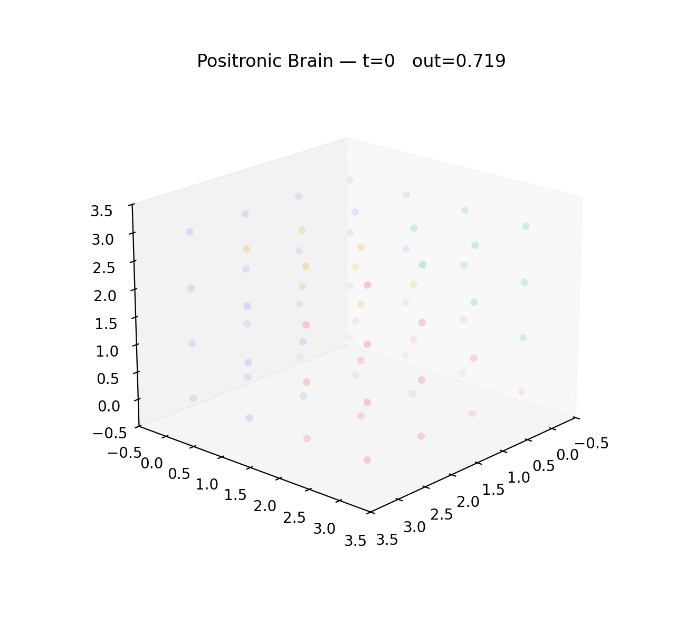

<div align="center">

# 🧠 Positronic Brain

**A biomimetic, learnable, sparse 3D neuronal network — used *directly* as a generative model.**

[](LICENSE)
[](pyproject.toml)
[](https://pytorch.org)
[](https://github.com/Dr-Pro-Group/project_positronic_brain/actions/workflows/ci.yml)
[](#-honest-scope)



<sub>Firing-rate activity settling through the 3D neuron lattice.</sub>

</div>

---

A population of **conductance-based, leaky-integrator neurons** embedded in *literal*
3D space, wired by a **distance-biased sparse graph** (O(E), not O(N²)), constrained
by **Dale's law**, and trained end-to-end by backpropagation-through-time. It is not a
Transformer and not a wrapper around pretrained weights — the network's own recurrent
dynamics **are** the model. The same substrate runs as a character-level language model
and as a multimodal network whose distinct **zones** receive different input streams.

> ### 🔭 Honest scope
> This is a research testbed, not a production model. It is rate-based (not spiking),
> trained by backpropagation-through-time (the least biological part of the pipeline),
> and at laptop scale it behaves like a small biological char-RNN. Every biological
> mechanism is an **off-by-default, ablatable flag** that is byte-identical to baseline
> when disabled — so each can be measured independently.

## ✨ Highlights

- 🧩 **Genuinely 3D & sparse** — neurons on a cubic lattice; distance-biased, fan-in-capped wiring stored as an `edge_index` (scales as O(E), not O(N²)).
- ⚡ **Conductance dynamics + Dale's law** — `I_syn = gE·(E_E−V) + gI·(E_I−V)`, with separate excitatory/inhibitory populations.
- 🗣️ **A from-scratch generative LM** — the brain writes text through its own reverberation, with a content-disjoint held-out split and bits-per-char reporting.
- 🔬 **A library of ablatable biology** — divisive normalization, short-term plasticity, homeostasis, dendritic NMDA, a laminar microcircuit, e-prop, and more.
- 🌐 **Multi-stream specialization** — route different data into different zones and ask whether the zones *spontaneously specialize*.
- 📐 **Honest instrumentation** — held-out evaluation, frozen-reservoir probes, and quantitative specialization metrics.

## 🚀 Quickstart

```bash
python -m venv .venv && source .venv/bin/activate     # Python 3.11+
pip install -e ".[viz,data,multimodal]"
```

```python
from positronic_brain import PositronicBrain, BrainConfig

brain = PositronicBrain(BrainConfig(grid_size=8))       # 8³ = 512 neurons
state = brain.run_with_inputs([1, 0, 0, 0, 0, 0])        # drive the 6 zones
print(state["rates"].shape)
```

Train the generative language model (held-out bits-per-char + diagnostics):

```bash
python train_language.py --grid-size 12 --steps 800 --device auto --diagnostics
#   add any of: --divnorm --stp --homeostasis --persistent-state --learning-rule eprop
```

Runs on **CPU**, **Apple Silicon (MPS)**, and **CUDA** — pass `device="auto"` (default), `"cpu"`, `"mps"`, or `"cuda"`.

## 🧬 Architecture

| Piece | What it is |
|---|---|
| **Neuron** | rate-based leaky integrator: `τ dV/dt = −(V−E_L) + I_syn + I_ext + b`, firing rate `r = σ(γ(V − θ))` |
| **Synapse** | conductance-based driving force: `I_syn = gE·(E_E−V) + gI·(E_I−V)` |
| **Connectivity** | sparse 3D graph (`edge_index`), distance-biased, fan-in-capped; learnable per-edge weights |
| **Dale's law** | neurons are excitatory or inhibitory; sign fixed per source |
| **Zones** | a Voronoi partition into regions (Visual, Auditory, Somatosensory, Memory, Emotion, Association); each can receive a distinct input stream |

## 🔬 Biological mechanisms

All **off by default** and byte-identical to baseline when disabled — see
[docs/biological_mechanisms.md](docs/biological_mechanisms.md).

| Flag | Mechanism |
|---|---|
| `--divnorm` | divisive normalization (Carandini & Heeger) |
| `--stp` | short-term synaptic plasticity (Tsodyks–Markram) |
| `--homeostasis` | homeostatic intrinsic-gain control (Turrigiano) |
| `--oscillation` | theta-like inhibitory pacemaker |
| `--dendrites` | per-branch NMDA nonlinearity |
| `--laminar` | canonical L4→L2/3→L5/6 microcircuit |
| `--learning-rule eprop` | forward-only, biologically-local credit assignment |
| `--persistent-state` | carry membrane state across windows |

## 🌐 Multimodal & emergent zone specialization

Different data streams enter through **spatially-distinct zones**, and per-stream heads
decode each stream from the settled firing-rate pattern. The active research question:
do zones near each entry door **spontaneously specialize** for their stream?

```python
from positronic_brain.multimodal import MultiStreamBrain, StreamSpec
from positronic_brain import specialization as spec

brain = MultiStreamBrain([
    StreamSpec("vision", 512, "Visual"),
    StreamSpec("audio",  512, "Auditory"),
    StreamSpec("text",   512, "Association"),
], grid_size=12)

brain.reroute("vision", "Memory")               # cross-modal-rewiring experiment, one call
sel = spec.selectivity_index(brain, samples)    # which zone prefers which stream
```

## 📦 Repository layout

```
positronic_brain/   core package — model, connectivity, zones, language, encoders,
                    diagnostics, streaming, eprop, multimodal, specialization, …
train_language.py   char-LM trainer (held-out eval + mechanism flags)
tests/              pytest suite (77 tests)
docs/               architecture + usage documentation
examples/           notebooks
```

## 🧪 Tests

```bash
pytest -q tests/
```

## 📄 License

[MIT](LICENSE).
