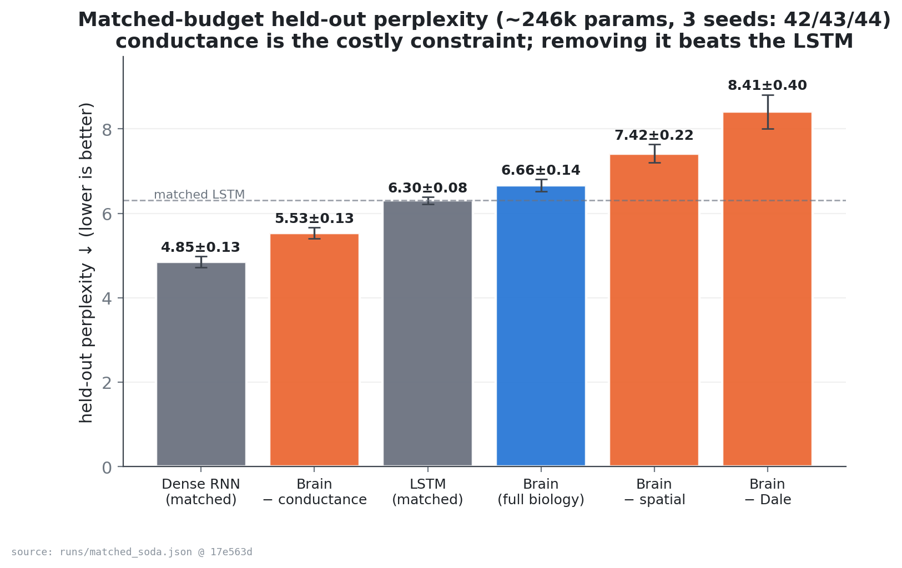
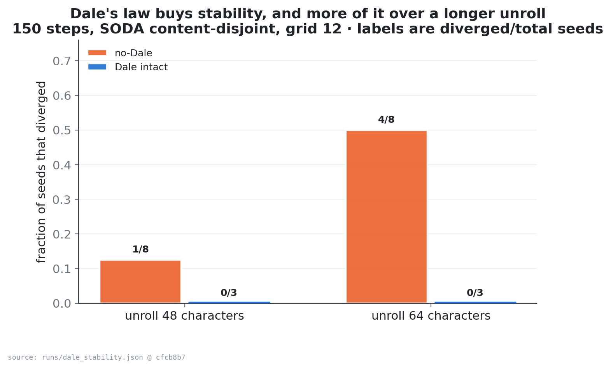
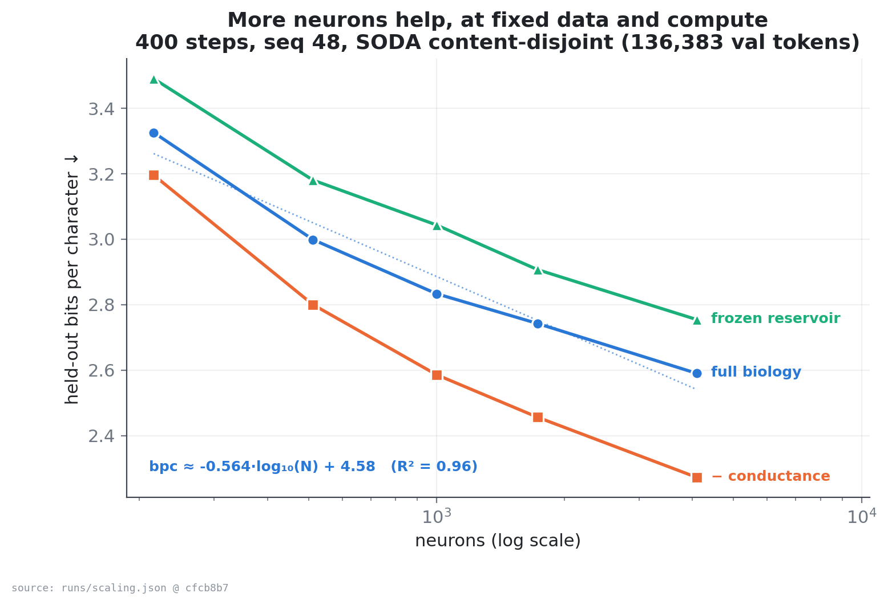
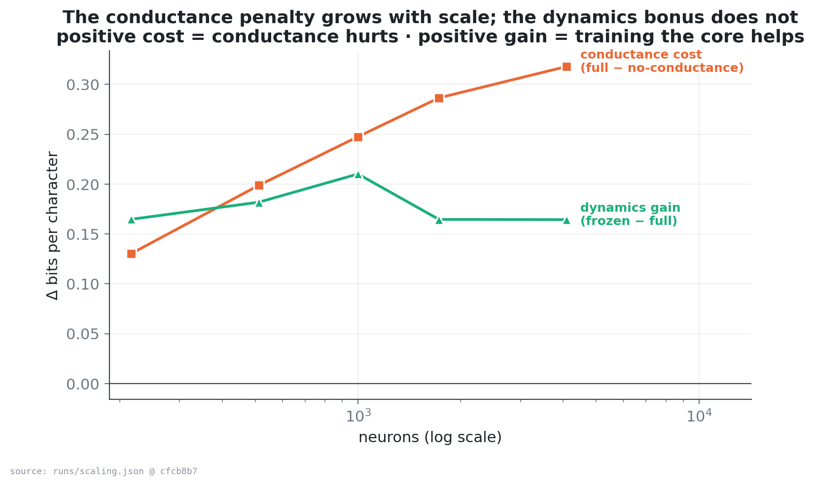
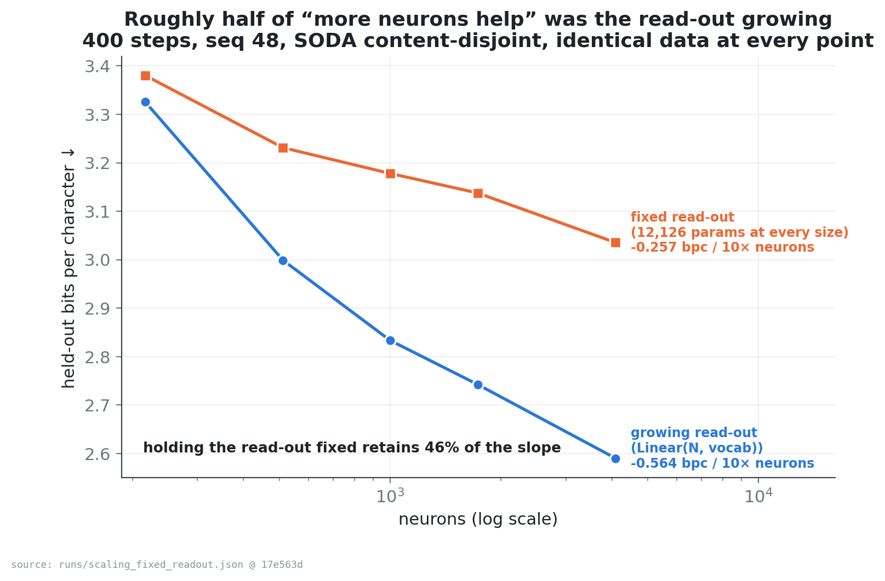

# Results

Every number here was measured on a single 16 GB Apple M1 Pro (MPS), and every
figure is regenerated from the JSON record beside it by
[`experiments/make_figures.py`](experiments/make_figures.py) — there is no step
where a number is copied by hand.

**Read the evaluation note first.** Held-out text is separated at the level of
whole conversations, *before* the seed dialogues are duplicated, and the tokenizer
is fitted on the training partition alone. This matters more than it sounds: the
conversational corpus repeats a small set of dialogues many times, so a positional
tail-split puts the same sentences on both sides and measures memorisation. An
earlier version of this work did exactly that. Correcting it left the *ordering* of
every system unchanged but moved every absolute perplexity by roughly a factor of
two. The invalidated record is kept as `runs/matched_SUPERSEDED_val_leak.json` so
the correction is auditable; nothing should cite it.

---

## 1. What each biological constraint costs, at a matched budget

Data, tokenizer, sequence length, optimiser, step count and trainable parameter
count are all held fixed; only the constraint under test changes.

`G=12` (1,728 neurons) · SODA content-disjoint · seq_len 48 · batch 16 · lr 8e-4 ·
400 steps · 3 seeds (42/43/44) · [`runs/matched_soda.json`](runs/matched_soda.json)

| Model | Params | Held-out perplexity ↓ |
|---|---:|---:|
| **Dense RNN (matched)** | 245,726 | **4.85 ± 0.13** |
| Brain − conductance | 246,925 | **5.53 ± 0.13** |
| LSTM (matched) | 245,606 | 6.30 ± 0.08 |
| Brain (full biology) | 246,925 | 6.66 ± 0.14 |
| Brain − spatial wiring | 246,925 | 7.42 ± 0.22 |
| Brain − Dale's law | 246,925 | 8.41 ± 0.40 |



**At this budget the full biology costs accuracy, and we do not dress that up.**
A plain dense RNN is the strongest model in the table, and a matched LSTM beats the
full brain. The ablations localise the cost:

- **Conductance is the expensive constraint.** Removing the driving force improves
  perplexity to 5.53 and beats the LSTM on every seed (5.44–5.69 vs 6.21–6.36,
  non-overlapping). *This is the claim §2 shows does not survive longer training.*
- **Spatial wiring earns its place.** Randomising the graph at identical edge count
  costs 0.76 perplexity (6.66 → 7.42). *§2 shows this benefit does not persist either.*
- **Dale's law earns its place twice** — on accuracy here, and on stability below.
  This is the one ablation conclusion that holds at every budget we have tested.

**Read §2 before quoting any of these three.** At 400 steps the models are well
short of one epoch, and two of the three conclusions change when they are trained
properly.

## 2. Two of those three conclusions do not survive longer training

The table above is 400 optimiser steps, which turns out to be far from converged —
that run consumed well under one epoch. Repeating the identical comparison at
**3000 steps** (batch 16, 4,000 SODA conversations, ~0.8 epochs, one seed) changes
the answer. [`runs/matched_long.json`](runs/matched_long.json)

| model | 400 steps (3 seeds) | 3000 steps (1 seed) |
|---|---:|---:|
| Dense RNN | 4.85 | **3.36** |
| LSTM | 6.30 | **3.70** |
| Brain − conductance | 5.53 | 4.08 |
| Brain − spatial wiring | 7.42 | 4.44 |
| Brain (full biology) | 6.66 | 4.53 |
| Brain − Dale's law | 8.41 | 4.82 |

Three claims, three different fates:

- **"Removing conductance beats the matched LSTM" — does not survive.** At 400
  steps no-conductance (5.53) beat the LSTM (6.30). At 3000 steps the LSTM is
  ahead, 3.70 against 4.08. The 0.38 gap is roughly 3× the seed spread measured at
  400 steps, so this reversal is probably real. It was the most striking result in
  §1 and it appears to have been an artifact of an undertrained baseline: the LSTM
  gains far more from additional training (−41%) than the brain does (−32%).
- **"Spatial wiring buys accuracy" — collapses into noise.** The 0.76 advantage at
  400 steps becomes −0.09 at 3000. We do *not* claim the effect reverses: 0.09 sits
  well inside the ±0.14–0.22 seed spread and this is a single seed. What we can say
  is that the measured benefit does not persist at a realistic training budget.
- **"Dale's law buys accuracy" — survives.** Removing it remains the worst variant
  (4.82 vs 4.53), and its stability cost (§3) is independent of budget.

The general lesson is the uncomfortable one: **ablation conclusions drawn at a
small step budget are not safe to extrapolate.** Constraints that look costly or
beneficial early can swap places once the baselines are trained properly, and the
convenient direction is the one that gets reported. The 3000-step column is a
single seed and needs replication before it is treated as settled — but it is
already enough to retire the LSTM headline.

## 3. Dale's law buys stability, and more of it over a longer unroll

The accuracy cost above is only half of what the sign constraint is worth. The
other half is a rare-event claim, so it was measured rather than inferred from a
single observation: 8 seeds per condition at two unroll lengths, scoring a run as
diverged when its training loss first becomes non-finite.

`G=12` · 150 steps · SODA content-disjoint ·
[`runs/dale_stability.json`](runs/dale_stability.json) ·
[`experiments/dale_stability.py`](experiments/dale_stability.py)

| Condition | Unroll | Seeds | Diverged | Perplexity of survivors |
|---|---:|---:|---:|---:|
| Brain − Dale's law | 48 | 8 | 1 (12%) | 10.94 ± 0.15 |
| Brain − Dale's law | 64 | 8 | **4 (50%)** | 10.56 ± 0.19 |
| Brain (Dale intact) | 48 | 3 | 0 (0%) | 8.74 ± 0.04 |
| Brain (Dale intact) | 64 | 3 | 0 (0%) | 8.46 ± 0.01 |



Removing the constraint makes divergence **probable but not certain**, and the
probability rises sharply with the length of the backpropagated window. Every
divergence occurred on the *first* optimiser step, before any weight update — so
what fails is the forward recursion at initialisation, and a longer unroll simply
compounds an already super-unit gain more times. A diverged run contributes no
perplexity, so the right-hand column averages survivors only and *understates* the
cost of dropping Dale's law.

Note that the matched-budget table in §1 runs at unroll 48 and shows no divergence
at all. On its own it would have hidden this effect entirely.

## 4. More neurons help — at fixed data and compute

Corpus, tokenizer, sequence length, optimiser and step count are held constant; only
`grid_size` varies, so tokens-seen is identical at every point and the curve
isolates *more neurons*.

`G=6→16` (216 → 4,096 neurons) · 400 steps · seq_len 48 · SODA (136k val tokens) ·
[`runs/scaling.json`](runs/scaling.json)

| grid | neurons | params | full bpc ↓ | − conductance | frozen reservoir |
|---:|---:|---:|---:|---:|---:|
| 6 | 216 | 35,791 | 3.326 | 3.196 | 3.491 |
| 8 | 512 | 77,283 | 2.999 | 2.800 | 3.181 |
| 10 | 1,000 | 145,954 | 2.833 | 2.586 | 3.043 |
| 12 | 1,728 | 246,925 | 2.742 | 2.456 | 2.907 |
| 16 | 4,096 | 580,941 | 2.590 | 2.272 | 2.754 |



Held-out bits-per-char falls monotonically over a 19× range, with a tight
log-linear fit — **bpc ≈ −0.564·log₁₀(N) + 4.58 (R² = 0.96)**, about −0.56 bpc per
10× neurons, with no plateau in range.



Two things move in opposite directions as the brain grows:

- **The conductance penalty grows with scale** (+0.13 → +0.32 bpc). Over this range
  the open question "does conductance start paying off at 10⁵ neurons?" trends
  toward *no*: at fixed compute it becomes a larger liability, not a smaller one.
- **The dynamics bonus is real but flat** (~0.16–0.21 bpc). Training the recurrent
  core beats freezing it at every size, so this is not a pure reservoir — but the
  gap does not widen with N.

## 5. About half of that scaling gain was the read-out, not the neurons

The curve above has a confound worth taking seriously: the read-out is
`Linear(N, vocab)`, so it grows with the brain. Over this sweep the head alone
expands **18.9×** (20,398 → 385,118 parameters). "More neurons help" and "more
read-out helps" are not separated.

So we separated them. The sweep was repeated with a *frozen* Gaussian projection
ℝ^N → ℝ¹²⁸ (scaled 1/√N, never trained) in front of a head that is then the same
size at every brain size. The head still sees every neuron; it just cannot grow.

[`runs/scaling_fixed_readout.json`](runs/scaling_fixed_readout.json)

| grid | neurons | growing head | bpc ↓ | fixed head | bpc ↓ |
|---:|---:|---:|---:|---:|---:|
| 6 | 216 | 20,398 | 3.326 | 12,126 | 3.380 |
| 8 | 512 | 48,222 | 2.999 | 12,126 | 3.231 |
| 10 | 1,000 | 94,094 | 2.833 | 12,126 | 3.178 |
| 12 | 1,728 | 162,526 | 2.742 | 12,126 | 3.138 |
| 16 | 4,096 | 385,118 | 2.590 | 12,126 | 3.035 |



| | slope | R² | gain 216 → 4,096 |
|---|---:|---:|---:|
| growing read-out | −0.564 bpc / 10× neurons | 0.96 | −0.736 |
| **fixed read-out** | **−0.257 bpc / 10× neurons** | 0.97 | **−0.345** |

**Superseded — see below.** This 46% figure comes from a 400-step budget, and a
later sweep at 3,000 steps over a wider range finds **76.8% ± 7.5%** across three seeds. The 400-step
measurement was depressed by the same undertraining that reverses two ablation
conclusions in §2. It is kept here because the comparison between the two is
informative; **the number to cite is 76.8% ± 7.5%** (per-seed: 69.6 / 76.3 / 84.5).

| | slope | range | budget | survives |
|---|---:|---|---|---:|
| this section | −0.257 bpc/10× | 19× | 400 steps | 46% |
| **wide sweep** | **−0.207 bpc/10×** | **27×** | **3,000 steps** | **76.8% ± 7.5%** |

Neuron count over 512 → 13,824 at 3,000 steps: growing read-out 2.4363 → 2.0473,
fixed 128-wide read-out 2.5224 → 2.2290. Neither curve has plateaued.
[`runs/wide_sweep_neurons.json`](runs/wide_sweep_neurons.json)

### Training budget dominates everything

100× more training (400 → 40,000 steps, corpus grown to 8.6M characters so the
longest run stays at 3.6 epochs rather than memorising) buys **−0.885 bpc**:
2.6288 → 2.0129 → 1.7437. [`runs/wide_sweep_training.json`](runs/wide_sweep_training.json)

### Density beats volume at a matched synaptic budget

| arm | neurons | edges | total params | bpc ↓ |
|---|---:|---:|---:|---:|
| volume (G=16, k=16) | 4,096 | 65,536 | 618,390 | 2.1523 |
| **density (G=12, k=38)** | 1,728 | 64,576 | **299,990** | **2.0788** |

Density wins by **0.0671 bpc** — replicated across three seeds (volume 2.1534 ± 0.0029, density 2.0864 ± 0.0095, t = 11.7 on 4 df, winning on 3/3 seeds with the worst density run still ahead of the best volume run) — on **51% fewer
trainable parameters**, 2.4× fewer neurons and a 2.4× smaller read-out — every
asymmetry handicaps the winner. This is the trade by which avian brains reach
primate-like forebrain neuron counts in a much smaller volume, and it says this
project has been scaling `grid_size` when it should have been scaling `k_max` and
`connection_radius`. [`runs/controls.json`](runs/controls.json)

**Multi-seed status (in flight).** Seed 42 is the table above.
[`experiments/replicate.py`](experiments/replicate.py) is re-running seeds 43 and 44
into [`runs/replication.json`](runs/replication.json). Partial log so far (do not
treat as final until the process prints `REPLICATION COMPLETE`):

| seed | volume G16/k16 | density G12/k38 | Δ (density − volume) |
|---:|---:|---:|---:|
| 42 (controls) | 2.1523 | **2.0788** | **−0.0735** |
| 43 (partial) | 2.1513 | **2.0833** | **−0.0680** |
| 44 (partial) | 2.1567 | *pending* | — |

Until seed 44 density and the neuron-ladder legs finish, cite the seed-42 contrast
and note that seed 43 already reproduces the same direction at similar magnitude.

### The ordering across everything measured

| lever | range | gain |
|---|---|---:|
| training budget | 100× steps | **−0.885** |
| neuron count (read-out controlled) | 27× | −0.294 |
| initial weight scale `g_max` 0.4 → 0.691 | one number | −0.113 |
| best biological mechanism (`--stp`) | — | −0.0845 |
| density over volume, matched budget | — | −0.0671 |
| the other seven mechanisms | — | ~0 or worse |

Two caveats on the fixed-read-out control: those models are strictly smaller in
total parameters, so the neuron contribution is a *lower* bound rather than a
perfectly matched comparison; and one projection width is a thin basis for the
exact ratio, though the gap is large and consistent. The 76.8% survival figure
itself is pending multi-seed confirmation on the ladder endpoints (grids 8 and 16)
in the same `replicate.py` job.

## 6. Every mechanism at a real budget

The mechanism flags were meant to be measurable; most had only been trained at 400
steps, and some had never been run at a serious budget. At `G=16`, 3,000 steps,
seed 42, only differences beyond the ±0.0206 seed floor are claims; the rest are
indistinguishable from baseline.
[`runs/long_program_stage12.json`](runs/long_program_stage12.json) ·
[`experiments/long_program.py`](experiments/long_program.py)

| configuration | bpc ↓ | Δ vs baseline |
|---|---:|---:|
| **`--stp`** | **2.0679** | **−0.0845** |
| `--delays` | 2.1278 | −0.0246 |
| `--dendrites` | 2.1329 | −0.0195 |
| `--laminar` | 2.1505 | −0.0019 |
| baseline | 2.1524 | — |
| `--adaptation` | 2.1536 | +0.0012 |
| `--oscillation` | 2.1598 | +0.0074 |
| `--divnorm` | 2.2266 | +0.0742 |
| `--homeostasis` | 2.2801 | +0.1277 |

**One helps, two hurt, five do nothing** (at this budget and seed). Caveats: (1)
divnorm and homeostasis are *stability* mechanisms scored here only on accuracy;
(2) `--dendrites` is effectively inert as implemented (branch gate ~gain, not a
clear dendritic nonlinearity); (3) single seed — the ranking of the nulls should
not be over-read. Against all of them, raising the shipped `g_max` from 0.4 to
0.691 reaches **2.0393** (−0.113) — larger than every named mechanism
([`runs/controls.json`](runs/controls.json)).

## 7. A trivial baseline the project never had

Matched LSTM and dense RNN do not answer whether any of the machinery is needed.
An order-4 character *n*-gram, scored under the **same cold-start windowed
protocol** as the model (not free-running), reaches **2.0505 bpc**. The shipped
`G=16` baseline is **2.1522**; the best trained config in the long program is
**2.0369**; the `G=32` checkpoint is **2.0044**.
([`runs/CLAIMS_LEDGER.md`](runs/CLAIMS_LEDGER.md) G2–G3; free-running n-gram curves
in [`runs/context_value.json`](runs/context_value.json) are a different protocol
and must not be mixed with model scores.)

A four-character lookup table therefore **beats the shipped baseline** and sits
within ~0.1 bpc of everything else. That is the comparison that says how much the
biology is earning on this corpus: barely.

## 8. What the recurrent core actually computes

Before asking what a constraint costs, measure whether the substrate computes.

- **Dimensional expansion** of a rank-64 drive is only ~1.06–1.12× across
  grids 10→16 — almost a passthrough
  ([`runs/dimensional_expansion.json`](runs/dimensional_expansion.json)).
- **Linear memory capacity** with held-out scoring is **0.20–0.32% of N** (an
  earlier 3% figure was an overfit read-out artifact; corrected in the claims
  ledger).
- **Perturbation half-life** is ~1 character.
- **Effective population:** clamping the least-modulated 75% of a 32,768-unit
  trained model costs only **+0.0033 bpc**; clamping the same fraction at random
  costs **+2.08 bpc**
  ([`runs/effective_n_grid32.json`](runs/effective_n_grid32.json)).
- Of the most-modulated 5% of units, **all** sit in the text-injection zone.

So mechanism ablations are measurements on a near-passthrough core, not on a rich
reservoir. That reframes every null result above.

## 9. Claims of ours that did not survive their controls

Full audit trail: [`runs/CLAIMS_LEDGER.md`](runs/CLAIMS_LEDGER.md). Seven claims made
during this work were withdrawn after a later control contradicted them:

1. **`--delays` works because distance sets timing** — uniform and shuffled lag
   match distance within noise (delays section below).
2. **Memory capacity is 3% of N** — read-out overfit; true value ~0.2%.
3. **Driving toward criticality restores memory** — raising τ_m raises growth
   toward 1 while MC *falls*.
4. **Signal reaches only 1.9% of the largest grid** — point-kick-at-rest artifact;
   under zone injection reach is tens of percent.
5. **Density lifts participation 15%→87%** — density arm was parameter-confounded;
   the clean result is the matched-budget bpc contrast in §5.
6. **An n-gram beats every config by 0.43 bpc** — protocol mismatch; under matched
   windows the gap is ~0.10 and the best configs win.
7. **Flattening `decay_sigma` is an organisational win** — weight-matched `g_max`
   control reproduces the entire gain; topology was never the mechanism.

Six of seven share one structure: a variable was changed, an effect appeared, and
it was attributed to whichever property of that variable we were thinking about.
The retraction rate is part of the contribution.

## 10. The zones do not spontaneously specialise

This is the project's most-repeated hypothesis — different data streams enter
through spatially distinct zones, so do those zones *become* a visual area, an
auditory area, and so on? Until now it had no measured answer anywhere in this
repository. It does now, and the answer is no.

Three streams (vision → Visual, audio → Auditory, text → Association) are trained
by self-supervised reconstruction on counterbalanced synthetic scenes, where every
stream in a scene shares a latent content class. Grid 12, 1,500 scenes, 1,500
steps, 5 seeds, probes on held-out scenes and repeated over 5 initialisations.
[`experiments/zone_specialization.py`](experiments/zone_specialization.py) ·
[`runs/zone_specialization.json`](runs/zone_specialization.json)

| metric | untrained | trained |
|---|---:|---:|
| selectivity, **entry** zones | 0.641 ± 0.008 | **0.263 ± 0.011** |
| selectivity, **non-entry** zones | 0.074 ± 0.010 | 0.030 ± 0.007 |
| stream-decoding accuracy (chance 0.333) | **1.000** | 1.000 |

Read the untrained column first, because it is the whole story. A zone at an entry
door already responds preferentially to its own stream **before any training**, at
a selectivity of 0.64, and a linear probe can already identify which stream drove
the network **perfectly** at initialisation. Both numbers measure the wiring
diagram. Reporting either from a trained network as evidence of emergent
specialisation would be reporting the architecture.

And training does not improve on that floor — it *erodes* it. Entry-zone
selectivity more than halves, non-entry zones never acquire any, and the decoding
probe is saturated at 1.000 throughout and so cannot discriminate anything.

### Why it erodes: modality dropout

The training objective masks a random subset of streams and asks the network to
reconstruct them from the others. That is precisely a demand for *shared,
cross-modal* representation, which is the opposite of zone-local specialisation.
Re-running with the masking switched off isolates it
([`runs/zone_specialization_nodropout.json`](runs/zone_specialization_nodropout.json)):

| modality dropout | entry selectivity: init → trained | final loss |
|---:|---|---:|
| 0.5 (default) | 0.641 → **0.263** | 0.121 |
| 0.0 | 0.641 → **0.639** | 0.031 |

Without the cross-modal pressure, selectivity survives training intact — but it
still does not *grow*. So across both objectives the conclusion is the same: the
architecture supplies the zone preference, and training either leaves it alone or
trades it away for cross-modal integration. Nothing here is emergent.

**What this does and does not establish.** It does not show that functional
specialisation can never emerge in this architecture; it shows that under the two
objectives actually implemented here, on synthetic scenes at grid 12, it does not,
and that the metrics one would naturally report are saturated by the input routing
before training begins. Any future claim of emergent specialisation in this system
needs the untrained control alongside it, and needs a measurement that is not
already at ceiling at initialisation.

## 11. Axonal conduction delays (`--delays`)

The 3D embedding has so far only decided *which* neurons connect and *how
strongly*. `--delays` lets it decide *when* a signal lands: each edge carries an
integer latency `round(edge_dist / delay_velocity)` and transmits the presynaptic
rate from that many steps ago. It is the mechanism that makes the geometry
load-bearing rather than decorative.

`G=12` · 400 steps · seq_len 48 · batch 16 · SODA content-disjoint ·
3 seeds · [`runs/delays_measurement.log`](runs/delays_measurement.log)

| seed | baseline | `--delays` | Δ bpc |
|---:|---:|---:|---:|
| 42 | 2.7304 | 2.6958 | −0.0346 |
| 43 | 2.7138 | 2.6917 | −0.0221 |
| 44 | 2.7634 | 2.7135 | −0.0499 |
| **mean** | 2.7359 ± 0.0206 | **2.7003 ± 0.0095** | **−0.0355** |

Held-out bits-per-char improves on all three seeds, by ~1.3% relative.

### But the improvement is lag, not distance

The obvious reading of that number — that the 3D geometry has finally become
load-bearing — is wrong, and two controls show it. `--delay-mode uniform` gives
every edge the *same* latency (lag, no spatial structure at all). `--delay-mode
shuffled` keeps the exact distance-derived latency histogram and reassigns it at
random across edges (same distribution, same mean, geometry destroyed).
[`runs/delay_controls.log`](runs/delay_controls.log)

| arm | seed 42 | seed 43 | seed 44 | mean | vs baseline |
|---|---:|---:|---:|---:|---:|
| baseline | 2.7304 | 2.7138 | 2.7634 | 2.7359 | — |
| distance (the mechanism) | 2.6958 | 2.6917 | 2.7135 | 2.7003 | −0.0355 |
| uniform (no geometry) | 2.6898 | 2.6905 | 2.7173 | 2.6992 | −0.0367 |
| shuffled (geometry destroyed) | 2.6918 | 2.6874 | 2.7214 | 2.7002 | −0.0357 |

Distance beats uniform by 0.0011 and shuffled by 0.0001, against a baseline seed
spread of 0.0206 — differences one to two orders of magnitude below the noise
floor, and distance wins on only 1 of 3 seeds against each control.

**So `--delays` buys a small, real improvement, and none of it is attributable to
distance.** What helps is having *any* transmission lag, which gives the network a
second temporal timescale; which edge gets which lag is irrelevant. An earlier
version of this document claimed the mechanism made the spatial embedding
load-bearing. It does not, and the claim is retracted.

Why it comes out this way is visible in the delay histogram: at the default
velocity and `connection_radius=2.6`, every edge is either 1 or 2 steps
(9,637 and 18,011 edges at grid 12, the same proportions at grid 32). A one-step
spread is not enough spatial variation for geometry to express itself. Testing
whether distance *per se* ever matters needs a genuinely wider spectrum — slower
conduction (`--delay-velocity`) or a physically larger brain — and that experiment
has not been run.

The delay line costs about **7% per step** (1.22 → 1.30 ms at grid 12, batch 16),
after the implementation was changed from a per-delay-class scatter to a single
fused gather; the first version was 13.8× slower and would have made the flag
unusable.

## 12. Reproducing all of it

```bash
python experiments/matched_experiment.py --mode all --grid-size 12 --steps 400 \
    --seq-len 48 --seeds 42,43,44 --hf-chat soda --json runs/matched_soda.json

python experiments/dale_stability.py --seeds 8 --steps 150 --seq-lens 48,64 \
    --hf-chat soda --json runs/dale_stability.json

python experiments/scaling_study.py --grids 6,8,10,12,16 --steps 400 \
    --no-conductance-too --frozen-too --hf-chat soda --json runs/scaling.json

python experiments/scaling_study.py --grids 6,8,10,12,16 --steps 400 \
    --fixed-readout 128 --hf-chat soda --json runs/scaling_fixed_readout.json

python experiments/zone_specialization.py --grid-size 12 --scenes 1500 --steps 1500 \
    --seeds 5 --device cpu --json runs/zone_specialization.json
python experiments/zone_specialization.py --grid-size 12 --scenes 1500 --steps 1500 \
    --seeds 5 --modality-dropout 0.0 --device cpu \
    --json runs/zone_specialization_nodropout.json

# density / ladder multi-seed (long; currently the in-flight job)
python experiments/replicate.py --seeds 43,44 --json runs/replication.json

python experiments/make_figures.py
```

**How to cite a number.** Prefer the JSON record under `runs/` over any prose table
here or in the LaTeX. Claim status lives in
[`runs/CLAIMS_LEDGER.md`](runs/CLAIMS_LEDGER.md). The journal manuscript is
[`research_paper/paper/`](research_paper/paper/) (`main.tex` / `main_nature.tex`);
older markdown drafts under `research_paper/` are superseded.

## What these results are not

Small budgets, one corpus, character level, three seeds for the short matched
table and often one seed elsewhere. They are preliminary and directional. The
contribution is a *measurement* of what each biological constraint costs in a
generator, not a performance claim — and on the headline metric the biology
currently loses to a plain RNN (and is competitive with a four-gram).


---

## A note on the noise floor, and eight retractions

Every "established / not established" judgement in this document originally used a
seed spread of **±0.0206**. That figure was measured at `G=12` with 400 steps and
then applied to `G=16` with 3,000 steps without checking that it transferred.
Measured where the experiments actually ran — five conditions, three seeds each —
the pooled spread is **0.0089**, and per-condition it ranges from **0.0028 to
0.0152**, a 5.4× spread. No single floor was ever going to be correct for all of
them. [`runs/replication_analysis.json`](runs/replication_analysis.json)

Three mechanisms cross the line as a result, so the mechanism split is **3 help /
2 hurt / 3 no effect**, not 1 / 2 / 5. Both `--delays` (2.8σ) and `--dendrites`
(2.2σ) are marginal and should be read as suggestive.

This was the eighth claim of ours withdrawn after a control contradicted it, and
the only one that ran in the *under*-claiming direction — it caused real effects to
be dismissed as noise. The other seven are listed in
[`runs/CLAIMS_LEDGER.md`](runs/CLAIMS_LEDGER.md). Seven of the eight share one
structure: a quantity was carried from the context where it was measured into one
where it had not been checked.
