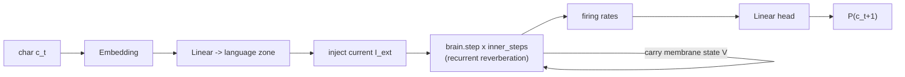

# Generative Language Model — the brain that writes

This document describes the **biomimetic generative language model**: a
from-scratch architecture in which the 3D `PositronicBrain` itself produces text,
one character at a time, through its recurrent membrane dynamics. There is **no
transformer, no attention, and no pretrained weights** — language emerges from
the brain's own reverberating activity.

## 1. The core idea

A transformer predicts the next token with attention over a fixed context
window. A biological cortex does something very different: it is a recurrent
network of neurons whose **persistent internal state** carries context through
time. We mimic the biological route:

1. A character is embedded and injected as **external current** into the neurons
   of one 3D "language" zone (default: `Association`).
2. The brain **reverberates** for a few integration steps — this recurrent
   settling is the model's "thinking" between characters (`inner_steps`).
3. The **firing-rate pattern** of all neurons is read out into a probability
   distribution over the next character.
4. The membrane potential `V` is **carried over** to the next character, so the
   brain's evolving 3D activity *is* the entire context and memory. There is no
   attention and no fixed window — only the living state of the network.

Trained by next-character prediction with backpropagation-through-time, the brain
learns to generate language from its own dynamics.



## 2. Components

| Piece | File | Role |
|-------|------|------|
| `CharTokenizer` | `positronic_brain/language.py` | from-scratch char vocab, encode/decode, save/load |
| `LMConfig` | `positronic_brain/language.py` | grid size, embed dim, `inner_steps`, language zone |
| `BrainLanguageModel` | `positronic_brain/language.py` | wraps a `PositronicBrain`; embed → inject → reverberate → read out |
| conversational corpus | `positronic_brain/corpus.py` | built-in offline `User:`/`Brain:` dialogue + file/HF loaders |
| training script | `train_language.py` | BPTT next-char training, periodic samples, checkpointing |
| `chat` / `ask` REPL command | `interact.py` | talk to a trained model live |

### `BrainLanguageModel` key methods

- `init_state(B)` — fresh membrane state `V` (B, N) at resting potential `E_L`.
- `step_token(V, token_ids)` — inject one character, reverberate `inner_steps`
  times, return `(V_next, logits)`.
- `forward(tokens)` — run over a `(B, T)` batch, return `(logits (B,T,vocab),
  final_V)`.
- `loss_on(tokens)` — next-character cross-entropy.
- `generate(tokenizer, prompt, max_new_tokens, temperature, top_k, stop)` —
  autoregressive sampling; the prompt warms up the brain's state.
- `save(path, tokenizer)` / `load(path)` — checkpoint config + vocab + weights.

## 3. Training

Fully offline by default (built-in conversational corpus, no downloads):

```bash
python train_language.py --steps 800 --grid-size 12 --out trained_models/brain_lm.pt
```

Train on your own text (the chat structure is still mixed in so the model can
chat):

```bash
python train_language.py --text mydata.txt --steps 2000
```

### Real public conversational data

The brain learns genuine turn-taking from public dialogue corpora (the same kind
used to train chat LLMs). They are **streamed** — only the first *N* conversations
are pulled, with no full download — and automatically reformatted into the
`User:` / `Brain:` structure. Use `--hf-chat`:

```bash
python train_language.py --hf-chat soda --hf-chat-limit 4000 --steps 3000
```

| Name        | Hub source                     | Notes                                       |
|-------------|--------------------------------|---------------------------------------------|
| `soda`      | `allenai/soda`                 | Natural two-party social dialogue (clean — recommended). |
| `ultrachat` | `HuggingFaceH4/ultrachat_200k` | Instruction-following multi-turn chat.      |
| `hh-rlhf`   | `Anthropic/hh-rlhf`            | Helpful/harmless transcripts (may contain explicit language). |

You can also pass any Hugging Face dialogue dataset path to `--hf-chat`. A
generic extractor (`positronic_brain/corpus.py`) handles three common shapes:
message lists (`role`/`content` or `from`/`value`), utterance lists (`dialogue`),
and `Human:`/`Assistant:` transcripts. Plain-text datasets (`tinystories`,
`wikitext`) still stream via `--hf`. The built-in offline corpus is appended
unless you pass `--no-builtin`.

### Filling memory to "grok" the corpus (Apple Silicon)

Pass `--target-mem-frac 0.9` and the trainer runs one probe step, measures the
per-sample activation footprint of backprop-through-time, then **auto-selects the
largest batch size that fits ~90% of total unified memory**. On a 16 GB M1 Pro
this lands around batch 6–8 at `grid_size 32` / `seq_len 48` (~14 GB), so the
brain trains on the most data per step the hardware can hold. Combine it with a
long run (`--steps 3000`) to fully *grok* the data:

```bash
PYTORCH_MPS_HIGH_WATERMARK_RATIO=0.0 python train_language.py \
    --grid-size 32 --hf-chat soda --hf-chat-limit 4000 \
    --steps 3000 --target-mem-frac 0.9 \
    --seq-len 48 --lr 8e-4 --grad-clip 0.5 \
    --sample-every 250 --device mps --out trained_models/brain_lm.pt
```

`PYTORCH_MPS_HIGH_WATERMARK_RATIO=0.0` lets MPS spill to swap instead of aborting
right at the memory ceiling. Large recurrent grids are sensitive, so keep
`--lr <= 1e-3` and a tight `--grad-clip 0.5` (the default `3e-3` can diverge at
`grid_size 32`).

Useful flags: `--grid-size` (neurons = grid_size³), `--embed-dim`,
`--inner-steps` (thinking depth per char), `--seq-len`, `--batch-size`,
`--target-mem-frac`, `--lr`, `--grad-clip`, `--sample-every`,
`--device {auto,cpu,mps,cuda}`, `--input-zone`, `--hf`, `--hf-chat`.

During training the script periodically prints a sample completion of
`User: hello\nBrain:` so you can watch language emerge as the loss drops.

## 4. Chatting with the brain

Inside the live REPL:

```bash
python interact.py --grid-size 12
# then at the prompt:
brain> chat hello
  Brain: ...
brain> ask what is a brain
  Brain: ...
```

The `chat`/`ask` command lazily loads `trained_models/brain_lm.pt` (override with
`--lm-path`). The user message is wrapped as `User: <msg>\nBrain:` and the brain
completes the turn.

## 5. Honest scope and scaling

At ~1k–5k neurons, character-level, trained briefly on a laptop, this behaves
like a small **biological char-RNN**: it produces novel, locally-coherent text
with real words and turn-taking, but not GPT-quality prose. That is expected and
honest — it is a genuinely new, from-scratch, recurrent, 3D, biomimetic generator,
not a scaled-up transformer.

Every part scales:

- **More neurons** — raise `--grid-size` (12 → 1728, 16 → 4096, 20 → 8000, 32 →
  32,768 neurons). Graph construction is **O(N·k)** (local-lattice neighbourhoods,
  no N×N distance matrix), so even 48 → 110,592 neurons *builds* in a few seconds.
- **Deeper thinking** — raise `--inner-steps`.
- **More / better data** — `--text`, `--hf`, or real dialogue via `--hf-chat`,
  with a larger `--steps`.
- **Fuller hardware use** — `--target-mem-frac 0.9` auto-sizes the batch to fill
  ~90% of unified memory, so each step trains on as much data as the machine holds.

The architecture stays the same; only the substrate grows — exactly like scaling
a biological cortex.

### Max neurons on this machine (Apple M1 Pro, 16 GB)

The default `grid_size` is **32 → 32,768 neurons**, the largest brain that still
*trains* at a workable speed here (~4–6 s per BPTT step on MPS). Memory is **not**
the bottleneck — after the O(N) connectivity rewrite the model builds 100k+
neurons in seconds — but the recurrent backprop-through-time compute grows with
`neurons × inner_steps × seq_len`, and beyond ~33k neurons each training step
takes minutes. For interactive *online* learning (`interact.py`), a smaller
`--grid-size 12` stays snappy; for the generative LM, 32 is the practical ceiling.

## 6. Tests

`tests/test_language.py` covers tokenizer round-trips, forward shapes, state
persistence across characters, generation, that training reduces loss, save/load
round-trips, and corpus structure.

```bash
python -m pytest tests/test_language.py -q
```
