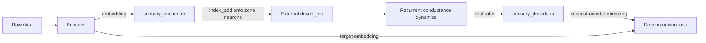

# Multimodal Perception & Live Self-Learning (v3.1)

This document describes the v3.1 additions that let Project Positronic Brain
ingest **real data** (images, text, audio, video) and **keep learning while you
interact with it**. It complements [architecture.md](architecture.md), which
covers the core 3D recurrent dynamics.

These features are implemented in three new modules:

| Module | Responsibility |
| --- | --- |
| `positronic_brain/encoders.py` | Turn raw data into fixed-size embedding vectors |
| `positronic_brain/model.py` (extended) | A per-neuron **sensory pathway** + **decode heads** |
| `positronic_brain/online.py` | Replay buffer, online learner, the `LiveBrain` wrapper |

---

## 1. Why this design

The original brain was driven by a handful of **zone-level scalars** (one input
per zone). That is enough to study dynamics, but it cannot represent *what* the
brain is seeing or hearing. To perceive real data we need three things:

1. A way to convert raw bytes (a JPEG, a sentence, a waveform) into a numeric
   vector — **encoders**.
2. A way to inject that vector into the right neurons — a **sensory pathway**.
3. A learning signal that needs **no labels**, so the brain can learn from a
   live, unlabelled stream — **self-supervised reconstruction**.

---

## 2. Encoders (`encoders.py`)

Every encoder exposes the same tiny interface:

```python
class Encoder(ABC):
    modality: str
    embedding_dim: int
    def embed(self, x) -> np.ndarray:   # L2-normalised (embedding_dim,) float32
        ...
```

Two families implement it:

### Pretrained (real) encoders

| Class | Modality | Backbone | Dim |
| --- | --- | --- | --- |
| `ClipImageEncoder` | image | CLIP ViT-B/32 image tower | 512 |
| `ClipTextEncoder` | text | CLIP ViT-B/32 text tower (shared space) | 512 |
| `AudioEncoder` | audio | Wav2Vec2 (mean-pooled, projected) | 512 |
| `VideoEncoder` | video | CLIP per sampled frame, averaged | 512 |

Image and text share **one** 512-d CLIP space, which is exactly what makes
cross-modal recall meaningful: *"a red square"* and a red-square image land close
together before they ever touch the brain. (Verified: image↔caption cosine is
higher for the matching caption than a distractor.)

The CLIP backbone is loaded via `transformers` and accessed through the stable
`vision_model`/`text_model` + projection submodules (so it is robust to
`transformers` API changes across major versions). Models download on first use.

### `FallbackEncoder` (offline, deterministic)

If `transformers` is not installed or a download fails, `build_encoder()` returns
a `FallbackEncoder`: it extracts coarse, **content-sensitive** features (byte
histogram for text, a gray grid for images, a binned spectrum for audio) and
projects them through a **fixed seeded random matrix**. It is deterministic
(same input → same vector), needs no network, and keeps the *entire* pipeline —
including the test suite — runnable offline.

```python
from positronic_brain.encoders import build_encoder, build_encoders
img = build_encoder("image", prefer_pretrained=True)   # real CLIP, or fallback
encoders = build_encoders(["image", "text", "audio"])  # one per modality
```

---

## 3. The per-neuron sensory pathway (`model.py`)

`BrainConfig` gained three optional fields:

```python
sensory_embedding_dims: Dict[str, int]   # {"image": 512, "text": 512, ...}
modality_to_zone:       Dict[str, str]   # {"image": "Visual", "text": "Association", ...}
sensory_gain:           Optional[float]  # current scale (defaults to input_gain)
```

When these are empty the brain is exactly the classic zone-scalar model
(full backward compatibility). When populated, `PositronicBrain.__init__` builds,
for every modality `m`:

- **Encode head** `sensory_encode[m] = nn.Linear(embed_dim, n_zone_neurons)` —
  projects the embedding to a current for each neuron of the target zone. The
  current is scattered onto the global `(B, N)` external-drive tensor with
  `index_add` over the precomputed neuron indices of that zone
  (buffer `_zoneidx_{m}`), which is fully autograd-friendly.
- **Decode head** `sensory_decode[m] = nn.Linear(N, embed_dim)` —
  reconstructs the modality embedding from the network's **final firing rates**.



`forward(...)` now accepts an optional `sensory={modality: embedding}` dict and a
`return_recon=True` flag, and `run_multimodal(...)` is a numpy-friendly inference
helper returning `output, rates, trace, positions, zones, recon`.

Default zone mapping: `image`/`video` → **Visual**, `audio` → **Auditory**,
`text` → **Association**.

---

## 4. Self-supervised online learning (`online.py`)

### Objective

There are **no labels**. The brain autoencodes the embeddings through its own
recurrent dynamics and minimises the reconstruction MSE:

$$\mathcal{L} = \frac{1}{|M|}\sum_{m \in M} \big\lVert \hat{e}_m - e_m \big\rVert_2^2$$

where $e_m$ is the encoder embedding for modality $m$ and $\hat{e}_m$ is the
decode head's reconstruction.

### Modality dropout → cross-modal recall

During each consolidation step a random subset of modalities is **dropped from
the input** (at least one is kept) while **all** are still required as targets.
This masked multimodal autoencoding forces the network to infer a missing
modality from the present ones — which is exactly **cross-modal recall**: drive
the brain with text, recover the matching image embedding.

### Replay & periodic gradient descent

- `ReplayBuffer(capacity)` — a bounded FIFO of recent observations.
- `OnlineLearner(brain, OnlineConfig(...))` — every `train_every` observations it
  samples a `batch_size` minibatch from the buffer and runs `train_steps` Adam
  steps. This **periodic gradient replay** lets the brain learn continually from
  a live stream without catastrophic forgetting of recent context.

```python
from positronic_brain.online import OnlineLearner, OnlineConfig
learner = OnlineLearner(brain, OnlineConfig(lr=5e-3, train_every=4, train_steps=2))
learner.observe({"image": img_emb, "text": txt_emb})   # perceive + maybe train
learner.consolidate(steps=20)                          # force extra training
```

`OnlineConfig` fields: `lr`, `train_every`, `train_steps`, `batch_size`,
`buffer_capacity`, `recon_weight`, `modality_dropout`, `seed`.

---

## 5. `LiveBrain` — the high-level wrapper

`LiveBrain` ties encoders + brain + learner together:

```python
from positronic_brain.online import LiveBrain

live = LiveBrain.create(
    modalities=["image", "text", "audio"],
    grid_size=12,            # ~1,700 neurons
    prefer_pretrained=True,  # False → offline FallbackEncoder
    device="auto",
)

live.perceive(text="a red apple", image="apple.jpg")  # encode → run → learn
recon = live.recall(text="a red apple")               # cross-modal reconstruction
live.save("trained_models/live_brain.pt")
```

The companion REPL `interact.py` exposes all of this from the terminal
(`perceive`, `pair`, `recall`, `consolidate`, `stats`, `save`). See the README
for the command reference.

---

## 6. Seeding from public datasets (`datasets.py` + `seed.py`)

Before any live interaction you can **bootstrap** the brain on real public data.
`positronic_brain/datasets.py` *streams* small, capped subsets straight from the
Hugging Face Hub (so only the first *N* usable samples are pulled — no
full-dataset download) and yields raw samples ready for `LiveBrain.perceive`:

| Helper | Source (with fallback) | Yields |
| --- | --- | --- |
| `stream_image_text(limit)` | `clip-benchmark/wds_mscoco_captions` → `wds_flickr30k` | `{"image": PIL, "text": str}` |
| `stream_audio_text(limit)` | `google/fleurs` (en) → LibriSpeech dummy | `{"audio": float32@16k, "text": str}` |

Two compatibility notes baked into the loader:

- `datasets` ≥ 4 dropped script-based datasets, so the defaults are
  parquet/webdataset repos.
- `datasets` ≥ 4 needs `torchcodec` to *decode* audio. We sidestep that by casting
  the audio column with `Audio(decode=False)` and decoding the raw bytes with
  **`soundfile`** (then linear-interp resampling to 16 kHz). No `torchcodec`
  required.

Field detection is generic (`jpg`/`image`, `txt`/`caption`/`transcription`, …)
with prioritized fallbacks, so a single code path survives schema differences and
degrades gracefully if a dataset is unavailable.

`seed.py` wires this into a one-command bootstrap: stream → encode (CLIP /
Wav2Vec2) → online-train → save a checkpoint.

```bash
pip install datasets soundfile          # one-time, optional
python seed.py --image-text 700 --audio-text 300 --grid-size 12 \
               --out trained_models/seeded_brain.pt
# then keep teaching it live:
python interact.py --load trained_models/seeded_brain.pt --modalities image text audio
```

**Reference run** (Apple Silicon / MPS): 1,000 real samples (700 COCO
image-captions + 300 speech-transcripts) into a 1,728-neuron brain drove the
reconstruction loss from **0.056 → 0.001**, and the loaded checkpoint performs
cross-modal recall (drive with text → reconstruct image + audio embeddings).

> At ~1.7k neurons recall is **associative/directional**, not photorealistic — it
> proves the mechanism. Raise `--grid-size` (16 → ~4k neurons) and the sample
> counts for stronger associations.

---

## 8. Scale: what is and isn't feasible

The aspiration was *"50 billion neurons, power-5 synapses"*. Concretely:

- 50e9 neurons × 5 synapses ≈ **2.5e11 parameters** ≈ **~0.5 TB fp16**.
- Realistic cortical fan-in (thousands of synapses/neuron) → **petabyte** scale.

Neither fits on a laptop. This project therefore demonstrates the **mechanisms**
— real multimodal encoding, a per-neuron sensory pathway, self-supervised online
learning, and cross-modal recall — at a tractable **~1k–5k neuron** scale
(`grid_size` 10–16). Every part scales by simply raising `grid_size`; the ceiling
is hardware, not architecture.

---

## 9. Tests

`tests/test_multimodal.py` (12 tests) covers: fallback encoder determinism and
content-sensitivity, multimodal forward shapes, backward compatibility with the
zone-scalar brain, sensory gradient flow, replay-buffer behaviour, that online
learning **reduces** reconstruction loss, that **paired cross-modal recall beats
chance**, the `LiveBrain` perceive/learn loop, and save/load round-tripping. The
full suite (`pytest -q`) is **26 tests, all passing**, fully offline.
